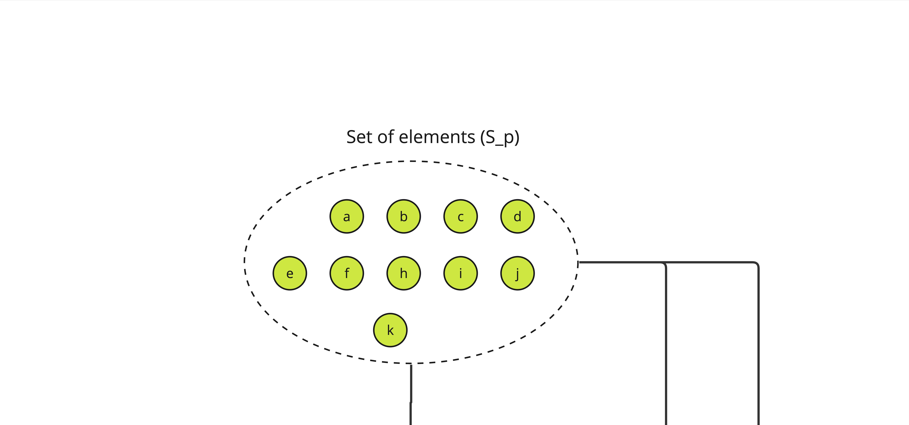
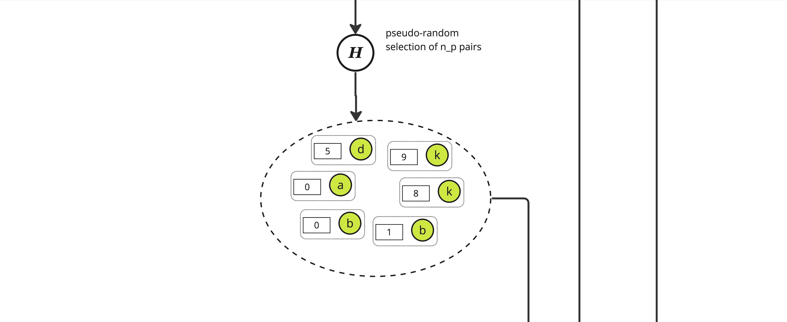
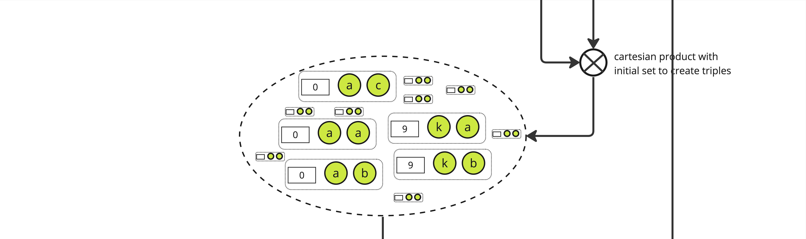
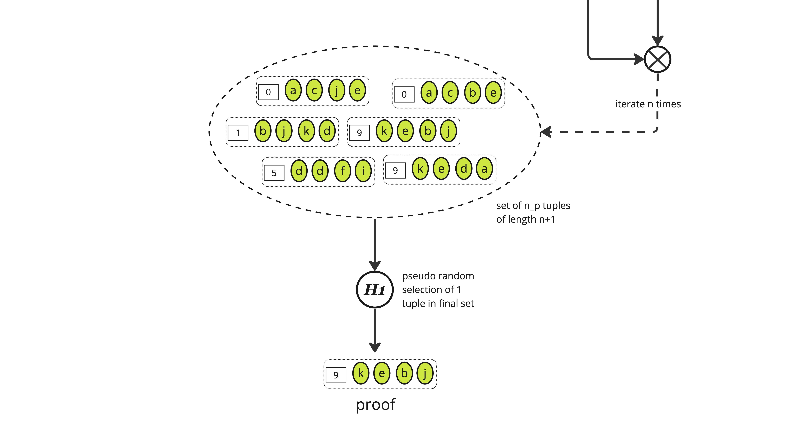

# Proving

Here is an alternative graphical representation of how ALBA certificates are produced, using the basic construction. We start with a set denote \\(S_p\\) of elements such that each is _unique_ and its availability can be asserted by a verifier through some predicate (called \\(R\\)) in the paper.

> **Note**: The \\(S_p\\) set can be smaller than the expected maximum number of elements we want to build a proof on, with a lower bound on \\(n_f\\) the number of expected honest elements.

The first step is to construct the cartesian product of each element of \\(S_p\\), here called \\(a\\) through \\(k\\), with all the integers lower than some parameter \\(d\\), yielding a set of size \\(\|S_p\| \times d\\)

From this set, we pseudo-randomly select \\(n_p\\) pairs using a "random oracle" \\(\mathbb{H}\\). \\(\mathbb{H}\\) is effectively just a hash function and to select the adequate number of pairs we pick those with a hash value modulo \\(n_p\\) equals to 0, yielding a set of size roughly \\(n_p\\) of pair of an integer and some item in \\(S_p\\).

> **Note**: The ratio \\(n_p / n_f\\) is a key factor when setting the needed length of the proof.

We then expand the set again, creating triples of an integer and 2 elements from \\(S_p\\) through a cartesian product between the selected pairs and the initial set, yielding a set of size \\(\|S_p\| \times n_p\\).

And we again pseudo-randomly select \\(n_p\\) elements from this new set using the same function \\(\mathbb{H}\\), yielding a set of triples of approximate size \\(n_p\\)

This process is iterated \\(n\\) times according to the protocol parameters (see the paper or [the code](https://github.com/cardano-scaling/alba/blob/8893e4b2de2cb9d74f135ec4535fbfca6acf83d3/src/ALBA.hs#L162) for details on how these parameters are computed), yielding a set of (roughly) \\(n_p\\) tuples of length \\(n+1\\) where each tuple is some "random" integer along with \\(n\\) items from \\(S_p\\).

The last stage consists in applying a function \\(\mathbb{H}_1\\) to select _one_ element from this set which is the final _proof_.

## Verifying

Verifying a given proof \\(P\\) is straightforward. Given the known share of honest items \\(n_p\\) and a security parameter \\(\lambda\\) (set at 128 in the paper) controlling the exponentially decaying probability a proof with dishonest items can be constructed, the verifier needs to check:

* The sequence of hashes from the items in the proof are all 0 modulo \\(n_p\\),
* The value of \\(H_1\\) for the whole sequence is 0 modulo some derived parameter \\(q\\),
* And of course that each item in the sequence is valid w.r.t. the predicate \\(R\\).
