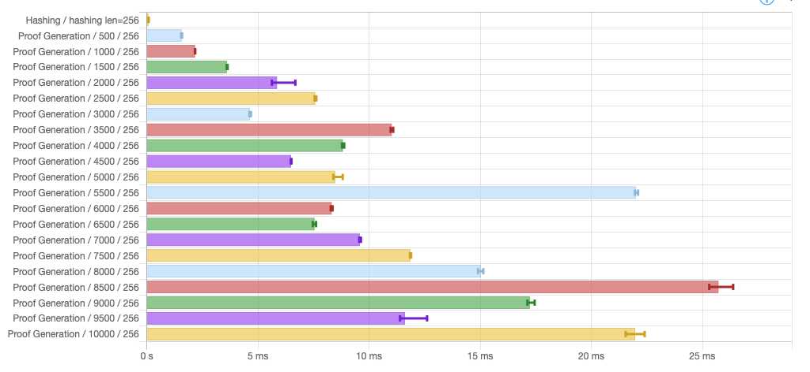
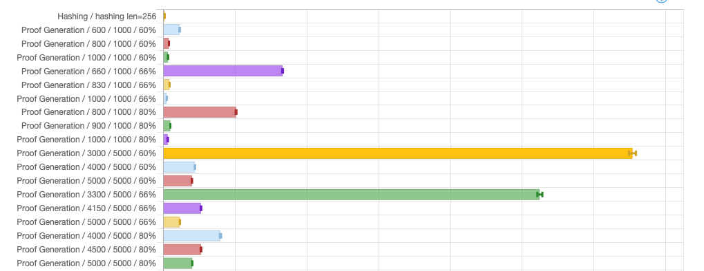

# Benchmarks

> **Note**: All these numbers were obtained on a single [C2, 4 CPUs, 16GB Ram](https://cloud.google.com/compute/docs/compute-optimized-machines#c2_series) machine from Google Cloud running Ubuntu 22.04.

## Simple benchmark

Shows proving time for various small number of items ([HTML](bench.html)):

While the benchmark shows execution time is roughly linear as the number of items increases, there are locally wild variations: A smaller number of items could lead to a significantly larger execution time. This seems easily explainable by the fact the number of hashes executed depends on the "shape" of the tree of data one needs to traverse. Even with identical set of data, different number of items yields different values for parameters \\(d\\), \\(u\\) and \\(q\\) which necessarily modify the computed hashes and therefore the depth-first search for a proof.

## Large benchmarks

Large benchmarks (in [HTML](bench-1000-100000.html) and [CSV](bench-1000-100000.csv)): Run time for all list of items from 1000 to 100000 stepped by 1000. The following picture represents a fraction of that data:

## Variance benchmark

Runs prover with _different_ set of data for _same_ number of items. Running ALBA prover on 10 different lists of 5000 items yields also varying running time, with a difference of a factor 2 between slowest and fastest. Again, this is explanable by the "random" nature of the data: Different lists can lead to different traversal of the tree when constructing the proof, some requiring more hashes than others.

Run time for 10 different list of 5000 items (in [HTML](bench-5000x10.html) and [CSV](bench-5000x10.csv)):

## Impact of actual vs. expected items set

This benchmark (in [HTML](bench-size-bound.html) and [CSV](bench-size-bound.csv)) varies the size of prover input set with respect to the size of \\(S_p\\), for different number of items over varying honest ratio (\\(n_p\\))

Execution time can dramatically increase as the number of items provided to the prover gets closer to the minimum expected number of honest items.
