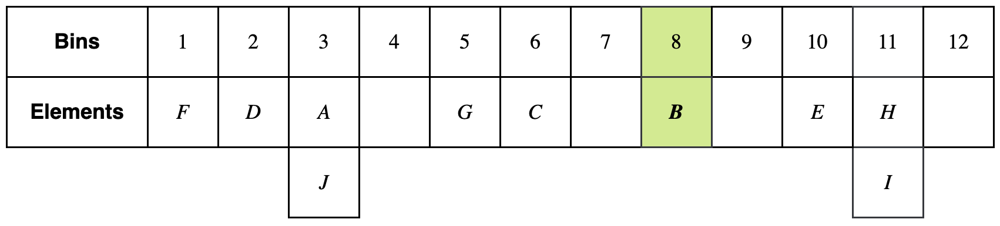
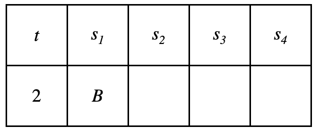
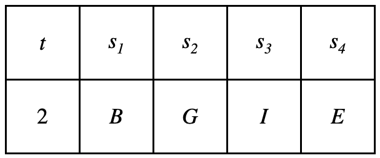
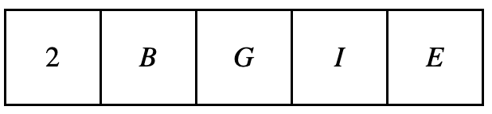

# Introduction

_Approximate Lower Bound Arguments_ are a form of cryptographic certificates that allow a _prover_ to convince a _verifier_ they know some large set of elements by providing only a small subset of those elements. 
This excellent [X thread](https://x.com/Quantumplation/status/1783188333046255997) provides a good intuition on why ALBAs are useful and how they work, and details of the theory behind this construction are beyond the scope of this introduction and can be found in the paper.

- Assume that a prover has a large collection of data. They want to convince a verifier that their set contains at least a minimum number of elements satisfying a specific predicate, known as a predicate. This remains true even if the prover only shares a portion of their data.
- A trivial solution to this problem would be for the prover to provide the entire dataset or the minimum number of distinct elements to the verifier. However, this approach is inefficient due to the large size of the data and communication costs.
- The Approximate Lower Bound Argument (ALBA) protocol is a new cryptographic primitive that solves this problem efficiently.
- ALBA is designed to prove knowledge efficiently by leveraging an *approximate lower bound*.
    - This approach exploits the gap between the prover's actual knowledge and the threshold needed to convince the verifier.
    - The gap enables compact proofs and efficient verification.
- ALBA supports both centralized and decentralized setups, as well as weighted and unweighted datasets, making it useful for applications such as blockchain protocols, voting systems, and multisignature schemes.

## How it works: Toy-size example

Let $S_p = \{ A, B, C, D, E, F, G, H, I, J \}$ be a set of elements.
The prover aims to convince the verifier that the set $S_p$, of size $n_p = 10$, contains at least $n_f = 7$ elements that satisfy a given predicate $R$ by sharing a small portion of the data.

- Size of prover's set: $n_p = 10$ 
- Proof length: $u = 4$
- Search width: $d = 12$

### Step 1: Prehashing the elements
Each element in $S_p$ is randomly assigned to a bin using the hash function $H_0$.

Suppose that $H_0(A) = 3$, then we put the element $A$ to bin $3$.

Compute the hash of each element in the set and obtain their bin numbers.

### Step 2: Constructing proof using DFS
#### Attempting with $t = 1$
The prover begins by computing $H_1(1)$ to determine the first bin to explore. 
Suppose $H_1(1) = 3$, leading the prover to examine **Bin 3**. 
From this bin, an element is selected, and suppose $A$ is chosen. 

At this point, the current sequence is $(t, s_1) = (1, A)$.

  

Next, the prover computes $H_1(1, A)$ to identify the next bin. 
Suppose $H_1(1, A) = 6$, directing the prover to **Bin 6**. 

This bin contains only one element, $C$, which extends the sequence to $(t, s_1, s_2) = (1, A, C)$.

  

Continuing the process, the prover computes $H_1(1, A, C)$ to find the next bin. 
Suppose $H_1(1, A, C) = 9$, directing the prover to **Bin 9**. 

However, **Bin 9 is empty**, meaning there is no valid extension for this sequence. 
As a result, the prover **backtracks** to **Bin 6**.
There is only one element in **Bin 6**, which is $C$.
So, the prover **backtracks** to **Bin 3**.
This time, instead of $A$, prover selects $J$ from **Bin 3**.

At this point, the current sequence is $(t, s_1) = (1, J)$.

  

Next, the prover computes $H_1(1, J)$ to identify the next bin.
Suppose $H_1(1, J) = 7$, directing the prover to **Bin 7**.

However, **Bin 7 is empty**, meaning there is no valid extension for this sequence.
As a result, the prover **backtracks and attempts $t = 2$** instead.

#### Attempting with $t = 2$
The prover begins by computing $H_1(2)$ to determine the first bin to explore. 
Suppose $H_1(2) = 8$, leading the prover to examine **Bin 8**. 

This bin contains only one element, $B$, which extends the sequence to $(t, s_1) = (2, B)$.

  

Next, the prover computes $H_1(2, B)$ to identify the next bin. 
Suppose $H_1(2, B) = 5$, directing the prover to **Bin 5**. 

This bin has a single element, $G$, which is added to extend the sequence to $(t, s_1, s_2) = (2, B, G)$.

  

Continuing the process, the prover computes $H_1(2, B, G)$ to find the next bin. 
Suppose $H_1(2, B, G) = 11$, directing the prover to **Bin 11**. 

From this bin, $H$ is selected, updating the sequence to $(t, s_1, s_2, s_3) = (2, B, G, H)$.

  

Then, the prover computes $H_1(2, B, G, H)$ to determine the next bin. 
Suppose $H_1(2, B, G, H) = 12$, leading to **Bin 12**, which contains no elements.
It means that there is no valid extension for this sequence.
As a result, the prover **backtracks** to **Bin 11**.

The prover selects $I$, updating the sequence as $(t, s_1, s_2, s_3) = (2, B, G, I)$.

  

Finally, the prover computes $H_1(2, B, G, I)$ to determine the next bin.
Suppose $H_1(2, B, G, I) = 10$, leading to **Bin 10**.

From this bin, $E$ is selected, completing the sequence to $(t, s_1, s_2, s_3) = (2, B, G, I, E)$.

  

### Step 3: Final proof selection
After reaching a tuple of length $u = 4$:

  

Prover computes $H_2(2, B, G, I, E)$.
  - If $H_2$ returns **1**, this tuple is **valid**, and we output it as the proof.
  - If not, we backtrack and try another sequence.

### Step 4: Verifier checks the proof
The verifier checks the proof by ensuring that each step follows the binning structure and that the mappings determined by $H_1$ correctly match the prehashed bins. 
Additionally, the verifier validates the final tuple using $H_2$. 

If $H_2(2, B, G, I, E) = 1$, the proof is **accepted**.
